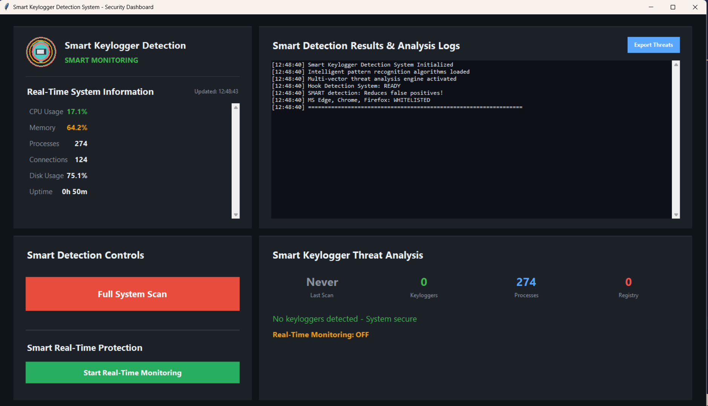

# 🛡️ Keylogger Detection and Prevention System

A lightweight **Windows security tool** built in **Python** to detect and prevent keylogger attacks.  
It monitors processes, files, and registry entries in real time using smart pattern recognition — all through a clean **Tkinter GUI**.

---

## ⚙️ Features
- Real-time process & file monitoring  
- Python keylogger pattern detection (`pynput`, `keyboard`, etc.)  
- Registry scan for persistence threats  
- Instant alerts & threat reporting  
- Smart whitelisting to reduce false positives  
- Exportable detailed threat reports  
- Simple interface — minimal setup required  

---

## 🧩 Requirements
- **OS:** Windows 7 or later  
- **Python:** 3.7+  
- **Install dependencies:**
  ```bash
  git clone https://github.com/sainiyash14/Keylogger-Detection-system.git
  cd keylogger-detection-system
  pip install -r requirements.txt
  python final-keylogger-detector.py

## 🕹️ Usage

1. Launch the app  
2. Click **Full System Scan** or enable **Real-Time Monitoring**  
3. Review alerts & export reports  
4. Take action on detected threats  

---

## 📸 Screenshot



---

## 🧠 Tech Stack

**Python**, **Tkinter**, **Psutil**, **Scikit-learn**, **Windows API (winreg, ctypes)**, **SQLite**

---

## 📄 License

Released under the **MIT License**  

**Author:** Yash Kumar Saini
